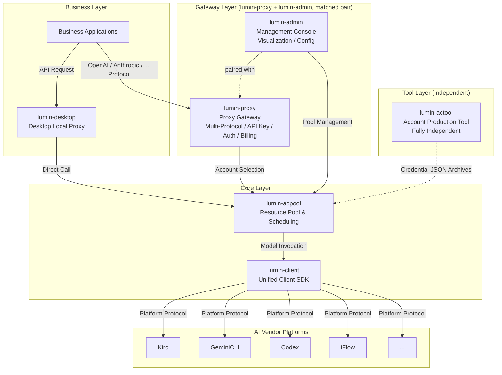
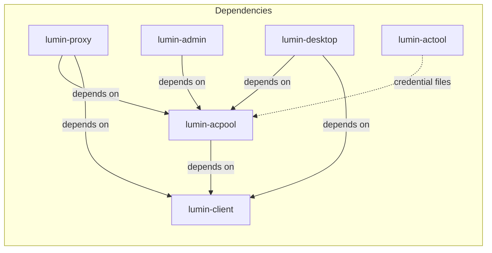

English | [中文](./docs/README_zh_CN.md)

## LUMIN

Light up AI routing. Hide the complexity.

---

### Introduction

**LUMIN** is a lightweight, unified AI proxy SDK ecosystem designed for multi-platform model invocation, account pool management, and intelligent routing.

It uniformly encapsulates and hides the protocol differences of various AI platforms such as **Kiro**, **GeminiCLI**, **Codex**, **iFlow**, etc., providing a consistent, concise, and stable calling interface. This allows upper-layer businesses to focus on their core logic without caring about the underlying platform details — perfectly embodying the core concept of **"Cloud Hiding"**: hide complexity at the bottom, leave simplicity for the business.

---

### LUMIN Ecosystem Overview

The LUMIN project consists of multiple sub-projects, each responsible for a specific domain, working together to form a complete AI proxy gateway system:

| Sub-Project | Role | Description |
|---|---|---|
| **lumin-client** | Client SDK | Core library for interfacing with various AI vendor platforms; provides unified request/response format conversion and usage rule parsing |
| **lumin-acpool** | Resource Pool Service | Core library for unified resource management, intelligent scheduling, availability assurance, and account allocation |
| **lumin-proxy** | Proxy Gateway | Business-layer proxy gateway supporting **multiple mainstream model protocols** (OpenAI, Anthropic, etc.), allowing users to call models via various standard protocols; also handles API key management, authentication, billing, and request forwarding; **works in tandem with lumin-admin** as a matched pair |
| **lumin-admin** | Admin Web Service | Web-based management console for account pool visualization, business API key management, user management, billing policies, and token top-up; **works in tandem with lumin-proxy** as a matched pair |
| **lumin-actool** | Account Production Tool | A fully **independent** CLI tool (no dependency on any other LUMIN sub-project) that produces account credential files across various AI vendor channels; outputs compressed archives of credential JSON files, which are then imported into lumin-acpool to ensure a steady supply of available accounts |
| **lumin-desktop** | Desktop Application | Local desktop proxy client built on lumin-client and lumin-acpool, providing standalone local proxy capabilities; serves as an alternative to lumin-proxy — users choose one or the other |

---

### Overall Architecture



---

### Sub-Project Relationships



- **lumin-client** is the foundational layer, depended on by all other sub-projects. It defines the `Provider` interface, `Credential` interface, unified `Request`/`Response` models, and platform-specific converters (Kiro, GeminiCLI, Codex, iFlow, etc.).
- **lumin-acpool** depends on lumin-client. It uses lumin-client's `Provider` for health checks and usage rule fetching, while itself handling credential management, credential validation, and resource pool scheduling capabilities on top.
- **lumin-proxy** and **lumin-admin** are a **matched pair** designed to work together: lumin-proxy serves as the user-facing proxy gateway for model requests, supporting **multiple mainstream model protocols** (OpenAI, Anthropic, etc.) so that users can call models via their preferred standard protocol; it also handles API key management, authentication, billing, and request forwarding. lumin-admin serves as the management backend for operations and configuration. lumin-proxy depends on both lumin-acpool and lumin-client; lumin-admin depends on lumin-acpool.
- **lumin-desktop** depends on lumin-acpool and lumin-client, implementing a standalone local desktop proxy client. It serves as a local alternative to lumin-proxy — users choose either the cloud-based lumin-proxy or the local lumin-desktop for their AI proxy needs.
- **lumin-actool** is a **fully independent** tool with no dependency on any other LUMIN sub-project. It is solely responsible for producing account credential files — outputting compressed archives of credential JSON files. These credential archives are then imported into lumin-acpool, ensuring the resource pool always has a steady supply of available accounts.

---

### About This Project: lumin-acpool

**lumin-acpool** is the **resource pool and scheduling engine** of the LUMIN ecosystem. It serves as the core middleware between the business/proxy layer and the AI client SDK layer, responsible for:

- **Multi-account management**: CRUD operations for accounts and provider groups
- **Intelligent account selection**: Multi-strategy load balancing at both provider and account levels
- **Availability assurance**: Circuit breaker, cooldown, health check, and auto-recovery mechanisms
- **Usage tracking**: Real-time quota estimation combining local counting with remote calibration
- **Flexible storage backends**: Memory, SQLite, MySQL, and Redis storage implementations
- **Concurrency control**: Occupancy-based adaptive/fixed-limit concurrency management

#### lumin-acpool Internal Architecture

```mermaid
graph TB
    subgraph "Balancer — Orchestration Layer"
        BAL[Balancer<br/>Top-level Orchestrator<br/>Resolve → Filter → Select → Report]

        subgraph "Discovery"
            RES[Resolver<br/>Service Discovery]
            GS[GroupSelector<br/>Provider Selection]
        end

        subgraph "Selection"
            OC[OccupancyController<br/>Concurrency Filter & Acquire]
            AS[Selector<br/>Account Selection]
        end

        subgraph "Resilience"
            CB[CircuitBreaker<br/>Circuit Breaker]
            CD[CooldownManager<br/>Cooldown Management]
            UT[UsageTracker<br/>Usage Tracking]
        end
    end

    subgraph "Health — Background Assurance"
        HC[HealthChecker<br/>Health Check Orchestrator]
        CC[CredentialCheck]
        UC[UsageCheck]
        PC[ProbeCheck]
        RC[RecoveryCheck]
        RF[RefreshCheck]
        MD[ModelDiscovery]
    end

    subgraph "Storage Layer"
        ACST[AccountStorage]
        PVST[ProviderStorage]
        STST[StatsStore]
        USST[UsageStore]
        OCST[OccupancyStore]
        AFST[AffinityStore]
    end

    subgraph "Storage Backends"
        MEM[Memory]
        SQLITE[SQLite]
        MYSQL[MySQL]
        REDIS[Redis]
    end

    %% Balancer Pick flow: Resolve → Filter → Select
    BAL -->|"①  Resolve Providers"| RES
    BAL -->|"②  Select Provider"| GS
    BAL -->|"③  Resolve Accounts"| RES
    BAL -->|"④  Filter by Occupancy"| OC
    BAL -->|"⑤  Select Account"| AS

    %% Balancer Report flow
    BAL -->|"Report"| CB
    BAL -->|"Report"| CD
    BAL -->|"Report"| UT

    %% Resolver → Storage
    RES --> ACST
    RES --> PVST

    %% OccupancyController → OccupancyStore
    OC --> OCST

    %% UsageTracker → UsageStore
    UT --> USST

    %% Stats
    BAL --> STST

    %% Health checks
    HC --> CC
    HC --> UC
    HC --> PC
    HC --> RC
    HC --> RF
    HC --> MD
    HC --> ACST

    %% Storage backends
    ACST --> MEM
    ACST --> SQLITE
    ACST --> MYSQL
    ACST --> REDIS
    PVST --> MEM
    PVST --> SQLITE
    PVST --> MYSQL
    PVST --> REDIS
    STST --> MEM
    STST --> MYSQL
    STST --> REDIS
    USST --> MEM
    USST --> REDIS
    OCST --> MEM
    OCST --> REDIS
    AFST --> MEM
    AFST --> REDIS
```



**Pick 核心流程**:
```
Balancer.Pick()
  │
  ├─ ① Resolver.ResolveProviders()          // 发现可用供应商列表
  ├─ ② GroupSelector.Select()                // 选取最佳供应商
  ├─ ③ Resolver.ResolveAccounts()            // 发现该供应商下的可用账号集
  ├─ ④ OccupancyController.FilterAvailable() // 过滤已达并发上限的账号
  ├─ ⑤ Selector.Select()                     // 从候选中选取最佳账号
  ├─ ⑥ OccupancyController.Acquire()         // 原子操作占用槽位
  └─ return PickResult

Balancer.ReportSuccess() / ReportFailure()
  │
  ├─ StatsStore                              // 更新调用统计
  ├─ UsageTracker.RecordUsage()              // 记录用量（触发冷却回调）
  ├─ CircuitBreaker.Record()                 // 熔断状态判定
  ├─ CooldownManager                         // 冷却管理
  └─ OccupancyController.Release()           // 释放占用槽位
```

#### Core Modules

| Module | Location | Description |
|---|---|---|
| **Balancer** | `balancer/` | Top-level orchestrator implementing the complete "discover → filter → select → report" flow with failover and retry support |
| **Resolver** | `resolver/` | Service discovery layer resolving available providers and accounts from storage; executes first in the Pick flow to produce candidate sets |
| **GroupSelector** | `selector/` | Provider-level selection strategy; built-in: Priority, MostAvailable, GroupAffinity |
| **Selector** | `selector/` | Account-level selection strategy; built-in: RoundRobin, Weighted, Priority, LeastUsed, Affinity |
| **OccupancyController** | `balancer/occupancy/` | Per-account concurrency control (sub-module of Balancer); filters over-limit accounts before selection and acquires slots atomically after selection; built-in: Unlimited, FixedLimit, AdaptiveLimit |
| **CircuitBreaker** | `circuitbreaker/` | Consecutive-failure-based circuit breaker with dynamic threshold calculation based on account usage rules |
| **CooldownManager** | `cooldown/` | Rate-limit-triggered cooldown management with configurable cooldown duration |
| **UsageTracker** | `usagetracker/` | Hybrid local+remote usage tracking for real-time quota estimation and proactive quota-exhaustion filtering |
| **HealthChecker** | `health/` | Background health assurance orchestrator with dependency-aware execution order; built-in checks: Credential, Usage, Probe, Recovery, Refresh, ModelDiscovery |
| **Storage** | `storage/` | Pluggable storage backends (Memory / SQLite / MySQL / Redis) for accounts, providers, stats, usage, occupancy, and affinity data |

#### Account Status Lifecycle

```
                    ┌──────────────────────────────────────────┐
                    │                                          │
                    ▼                                          │
 ┌─────────────────────┐   rate limit   ┌──────────────┐      │
 │     Available       │ ─────────────► │  CoolingDown  │──────┘
 │  (can be selected)  │                │ (auto-recover)│  cooldown expired
 └────────┬────────────┘                └──────────────┘
          │
          │ consecutive failures
          ▼
 ┌──────────────┐   timeout expired   ┌──────────────┐
 │ CircuitOpen   │ ──────────────────► │  Half-Open    │──► Available (on success)
 │ (excluded)    │                     │  (probe)      │──► CircuitOpen (on failure)
 └──────────────┘                     └──────────────┘

 Other terminal states: Expired → (refresh) → Available
                        Invalidated (permanent)
                        Banned (manual intervention)
                        Disabled (admin action)
```

#### Selection Strategies

**Provider-Level (GroupSelector)**:
- **MostAvailable** — Select the provider with the most available accounts
- **GroupAffinity** — Bind the same user to the same provider (for system prompt caching)

**Account-Level (Selector)**:
- **RoundRobin** — Even distribution across accounts
- **Weighted** — Selection based on account weight
- **Priority** — Select the highest priority account
- **LeastUsed** — Select the account with the most remaining quota
- **Affinity** — Bind the same user to the same account (for LLM context caching)

---

### Technical Features

- Written in pure **Golang**, high performance, low memory footprint
- Used as an **SDK library** — no intermediate service dependencies, simple deployment
- **Extensible architecture** — adding new AI platform support only requires an adapter layer
- Built-in **retry, circuit breaker, cooldown, health check** mechanisms
- Multiple storage backends: **Memory / SQLite / MySQL / Redis**
- Provides **CLI tool** for account and provider management
- Simple configuration, concise API design

---

### Project Positioning

**LUMIN = Cloud Hiding · Unified AI Proxy Gateway**

Let businesses focus only on logic, not platforms; let complexity be hidden, and calls be simpler.
