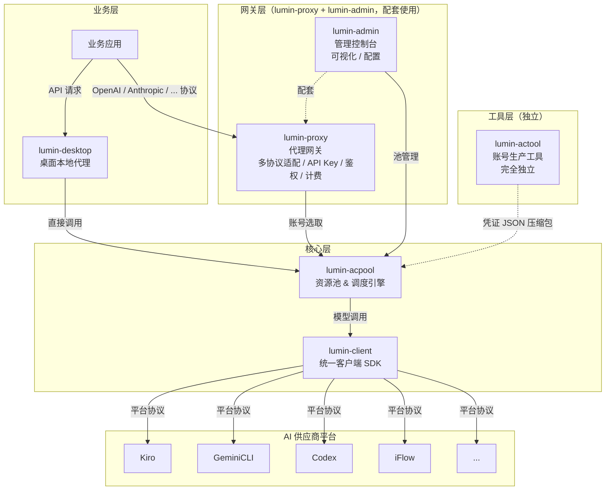
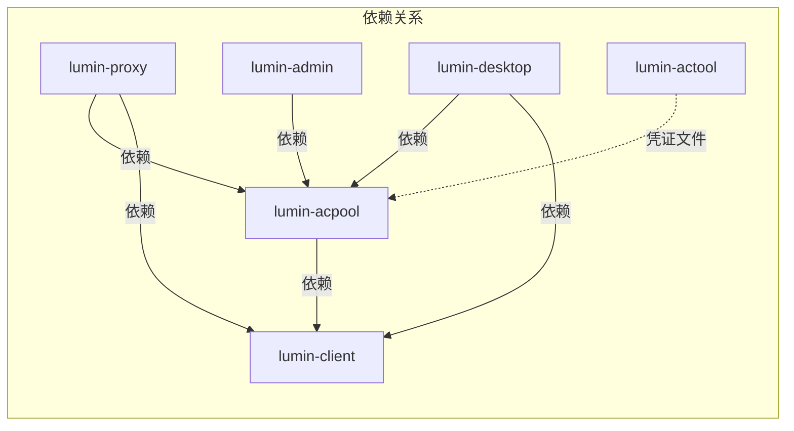
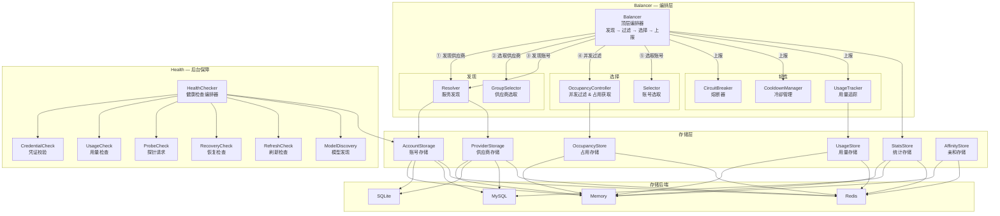

## LUMIN

点亮智能路由，隐藏底层复杂。

Light up AI routing. Hide the complexity.

---

### 简介

**LUMIN** 是一套轻量级、统一的 AI 代理 SDK 生态系统，专为多平台模型调用、账号池管理与智能路由设计。

它将 **Kiro**、**GeminiCLI**、**Codex**、**iFlow** 等不同 AI 平台的协议差异统一封装、完全隐藏，对外提供一致、简洁、稳定的调用接口，让上层业务无需关心底层平台细节——完美契合 **"云隐"** 核心理念：把复杂藏在底层，把简单留给业务。

---

### LUMIN 生态全景

LUMIN 项目由多个子项目组成，每个子项目各司其职，协同构成完整的 AI 代理网关系统：

| 子项目 | 定位 | 描述 |
|---|---|---|
| **lumin-client** | 客户端 SDK | 核心基础库，负责封装与各 AI 供应商平台的接口，提供统一的请求/响应格式转换、用量规则解析 |
| **lumin-acpool** | 资源池服务 | 核心调度库，负责资源的统一管理、智能调度、可用性保证和账号分配 |
| **lumin-proxy** | 代理网关 | 业务层代理网关，支持**多种主流模型协议**（OpenAI、Anthropic 等），用户可按多种标准协议调用模型；同时负责 API Key 管理、鉴权、计费和请求转发；**与 lumin-admin 配套使用** |
| **lumin-admin** | 管理 Web 服务 | Web 可视化管理控制台，负责账号池可视化管理、业务 API Key 管理、用户管理、计费策略、Token 充值等；**与 lumin-proxy 配套使用** |
| **lumin-actool** | 账号生产工具 | **完全独立**的 CLI 工具（不依赖任何其他 LUMIN 子项目），负责各渠道供应商账号凭证的批量生产，产出多个凭证 JSON 文件的压缩包，再导入 lumin-acpool 以确保资源池始终拥有充足的可用账号 |
| **lumin-desktop** | 本地客户端代理应用 | 基于 lumin-client 和 lumin-acpool 开发的桌面级本地代理客户端应用，提供独立的本地代理能力；与 lumin-proxy 二选一，用户可选择云端代理或本地代理 |

---

### 整体架构设计



---

### 子项目依赖关系



- **lumin-client** 是最底层的基础库，被其他所有子项目依赖。它定义了 `Provider` 接口、`Credential` 凭证接口、统一的 `Request`/`Response` 消息模型，以及各平台特有的协议转换器（Kiro、GeminiCLI、Codex、iFlow 等）。
- **lumin-acpool** 依赖 lumin-client，利用其 `Provider` 进行健康检查、用量规则获取，同时自身负责凭证管理与凭证校验，并在此基础上提供资源池调度能力。
- **lumin-proxy** 和 **lumin-admin** 是 **配套使用** 的一对组合：lumin-proxy 作为面向用户的代理网关，支持**多种主流模型协议**（OpenAI、Anthropic 等），用户可以按自己习惯的标准协议来调用模型；同时负责 API Key 管理、鉴权、计费、请求转发。lumin-admin 作为运维管理后台，负责可视化管理和系统配置。lumin-proxy 依赖 lumin-acpool 和 lumin-client；lumin-admin 依赖 lumin-acpool。
- **lumin-desktop** 依赖 lumin-acpool 和 lumin-client，实现独立的桌面级本地代理客户端应用。它与 lumin-proxy 的关系是 **二选一**：用户可以选择通过云端的 lumin-proxy 进行代理访问，也可以选择通过本地的 lumin-desktop 进行代理访问，两者在功能定位上互为替代方案。
- **lumin-actool** 是一个**完全独立**的工具，不依赖任何其他 LUMIN 子项目。它只负责生产账号凭证文件——产出多个凭证 JSON 文件的压缩包。这些凭证压缩包随后被导入 lumin-acpool，为资源池源源不断地供给可用账号。

---

### 关于本项目：lumin-acpool

**lumin-acpool** 是 LUMIN 生态中的 **资源池与调度引擎**。它作为业务/代理层与 AI 客户端 SDK 层之间的核心中间件，负责：

- **多账号管理**：账号和供应商组的增删改查操作
- **智能账号选取**：供应商级和账号级的多策略负载均衡
- **可用性保证**：熔断器、冷却、健康检查和自动恢复机制
- **用量追踪**：本地计数与远端校准相结合的实时配额估算
- **灵活存储后端**：支持 Memory、SQLite、MySQL、Redis 多种存储实现
- **并发控制**：基于占用率的自适应/固定上限并发管理

#### lumin-acpool 内部架构



**Pick 核心流程**：
```
Balancer.Pick()
  │
  ├─ ① Resolver.ResolveProviders()          // 发现可用供应商列表
  ├─ ② GroupSelector.Select()                // 选取最佳供应商
  ├─ ③ Resolver.ResolveAccounts()            // 发现该供应商下的可用账号集
  ├─ ④ OccupancyController.FilterAvailable() // 过滤已达并发上限的账号
  ├─ ⑤ Selector.Select()                     // 从候选中选取最佳账号
  ├─ ⑥ OccupancyController.Acquire()         // 原子操作占用槽位
  └─ return PickResult

Balancer.ReportSuccess() / ReportFailure()
  │
  ├─ StatsStore                              // 更新调用统计
  ├─ UsageTracker.RecordUsage()              // 记录用量（触发冷却回调）
  ├─ CircuitBreaker.Record()                 // 熔断状态判定
  ├─ CooldownManager                         // 冷却管理
  └─ OccupancyController.Release()           // 释放占用槽位
```

#### 核心模块说明

| 模块 | 包路径 | 描述 |
|---|---|---|
| **Balancer** | `balancer/` | 顶层编排器，实现完整的"发现 → 过滤 → 选择 → 上报"流程，支持 Failover 故障转移和 Retry 重试 |
| **Resolver** | `resolver/` | 服务发现层，从存储中解析可用的供应商和账号；在 Pick 流程中最先执行，产出候选集合 |
| **GroupSelector** | `selector/` | 供应商级选择策略；内置：Priority、MostAvailable、GroupAffinity |
| **Selector** | `selector/` | 账号级选择策略；内置：RoundRobin、Weighted、Priority、LeastUsed、Affinity |
| **OccupancyController** | `balancer/occupancy/` | 单账号并发控制器（Balancer 子模块）；在选择前过滤已达并发上限的账号，选择后原子获取占用槽位；内置：Unlimited、FixedLimit、AdaptiveLimit |
| **CircuitBreaker** | `circuitbreaker/` | 基于连续失败次数的熔断器，支持根据账号用量规则动态计算熔断阈值 |
| **CooldownManager** | `cooldown/` | 限流触发的冷却管理器，支持可配置的冷却时长 |
| **UsageTracker** | `usagetracker/` | 本地+远端混合的用量追踪器，实现实时配额估算和主动配额耗尽过滤 |
| **HealthChecker** | `health/` | 后台健康保障编排器，支持依赖感知的执行顺序；内置检查项：Credential、Usage、Probe、Recovery、Refresh、ModelDiscovery |
| **Storage** | `storage/` | 可插拔的存储后端（Memory / SQLite / MySQL / Redis），覆盖账号、供应商、统计、用量、占用、亲和等数据 |

#### 账号状态生命周期

```
                    ┌──────────────────────────────────────────┐
                    │                                          │
                    ▼                                          │
 ┌─────────────────────┐   触发限流    ┌──────────────┐       │
 │     Available       │ ────────────► │  CoolingDown  │───────┘
 │   （可被选取）       │               │ （自动恢复）   │  冷却到期
 └────────┬────────────┘               └──────────────┘
          │
          │ 连续失败
          ▼
 ┌──────────────┐    超时到期     ┌──────────────┐
 │ CircuitOpen   │ ──────────────► │  Half-Open    │──► Available（成功时）
 │ （排除选取）   │                │ （探测中）     │──► CircuitOpen（失败时）
 └──────────────┘                └──────────────┘

 其他终态：Expired → （刷新凭证）→ Available
           Invalidated（永久失效）
           Banned（平台封禁，需人工处理）
           Disabled（管理员手动禁用）
```

#### 选择策略

**供应商级（GroupSelector）**：
- **MostAvailable** — 选择可用账号最多的供应商
- **GroupAffinity** — 将同一用户绑定到同一供应商（利用 system prompt caching）

**账号级（Selector）**：
- **RoundRobin** — 轮询，均匀分配请求到各账号
- **Weighted** — 按账号权重加权选择
- **Priority** — 优先选择最高优先级账号
- **LeastUsed** — 选择剩余配额最多的账号
- **Affinity** — 将同一用户绑定到同一账号（利用 LLM 上下文缓存）

---

### 技术特点

- 纯 **Golang** 编写，高性能、低内存占用，适配后端服务场景
- 以 **SDK 库** 形式使用，无中间服务依赖，部署简单
- **可扩展架构**，新增 AI 平台接入仅需开发适配层，成本极低
- 内置 **重试、熔断、冷却、健康检查** 机制，提升服务可用性
- 多种存储后端支持：**Memory / SQLite / MySQL / Redis**
- 提供 **CLI 工具**，便于账号和供应商的管理操作
- 配置简单，API 设计简洁，开发者快速上手、快速集成

---

### 项目定位

**LUMIN = 云隐 · 统一 AI 代理网关**

让业务只关注逻辑，不关注平台；让复杂被隐藏，让调用更简单。
